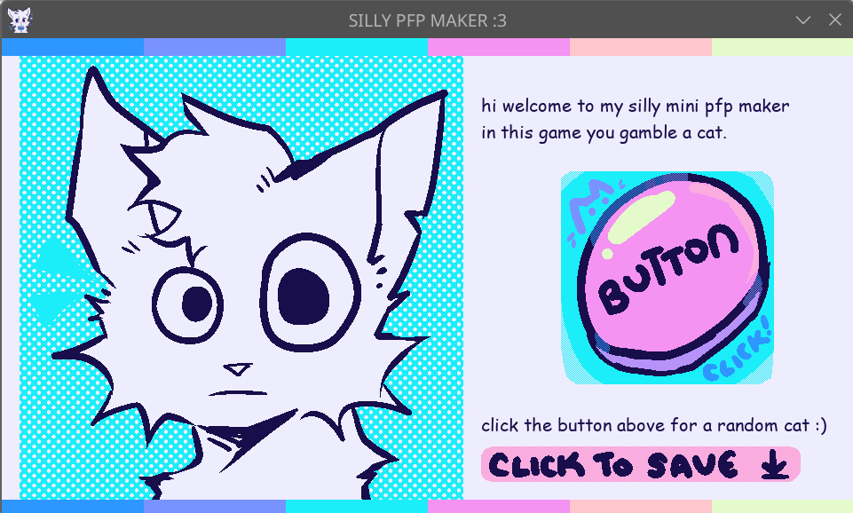
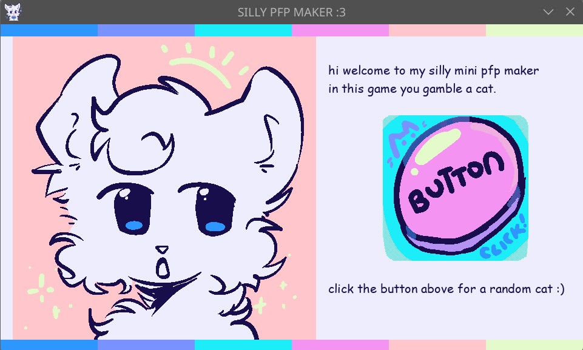
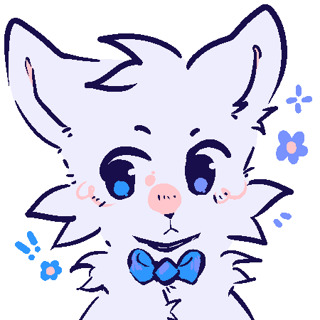

# silly-pfp-maker
A silly pfp maker for horizons, and to learn some pygame. I drew a bunch of pfps for [Fallout](fallout.hackclub.com), and thought maybe it would be fun to make a minigame where people could get a pfp in my style!

# screenshots

# the backstory (condensed version)
On the last day of fallout, Kaylee and Julia, in order to get back to america, needed money. They say something about weighted grants. So I said to Kaylee (with great cheer) "I'll ship to your ysws!!". A few hours later I tried to learn pygame at 1am ("surely this will be chill if I already know python!") but did not end up shipping to kaylee's ysws. A few days later I decided to make a website version of this silly pfp maker, because I think websites are pretty cool and I want to do more javascript.

But I did spend a few hours (5, apparently) making this while learning some basic pygame in the process, so I'm shipping a ✨ PFP MAKER DEMO VERSION!! ✨ where you press a **big pink button** to get a randomized pfp cat!

# how to play
* go to the [itch.io page](https://herbeon.itch.io/silly-pfp-maker-demo), download and run the executable! (requires linux or windows, but no python/pygame required!)
* randomize a pfp
* press the "click to save" button in-game or screenshot the pfp
* pfps are all pixel art so it should be pretty easy to edit them!
* credit herby on slack (feel free to message me on there for help, too!)

# no linux or windows?
* if you have python and pygame installed, you can clone this repo and run main.py :D

# how I made this project
There was no AI used for this project! I referenced a lot of pygame tutorials online, and the art was made in Krita by me. I was in transit after fallout so didn't get the chance to track my art, but I've probably spent ~1 hour on drawing all the assets so far. I used Pyinstaller to make an executable of the game, which [can be played on itch.io!]((https://herbeon.itch.io/silly-pfp-maker-demo))

# things I learned
This isn't my first time trying to do a pfp maker; I did draw the art for the pfp maker inside the fallout website, but it was in a more cutesy style and sophia's the one who programmed it in (very cool). So for this project I learned how to code one myself (albeit in a different language and with way less complex features, but it is my first time using pygame lol) and I got to draw pfp parts in a different style which was fun :D
It actually took me a bit of time to get pyinstaller working but after a lot of tutorials I got it done yay.

